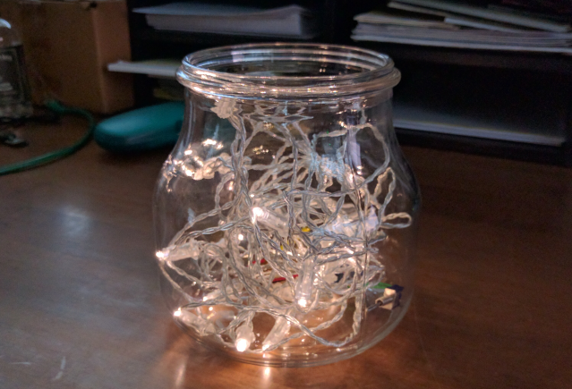

# Arduino Twinkle Lights in a Jar

## Introduction

This project is an Arduino variant of the Pimoroni Firefly Light (https://learn.pimoroni.com/tutorial/sandyj/firefly-light) project. Basically you place two strings of battery-powered LEDs into a glass jar and use a microcontroller to fade one strand up while the other strand fades down. The fade up/down process repeats for as long as the microcontroller has power. You could even add 1 or more strands of lights to the project if you want.

When I discovered the project, I thought it was really cool, but they threw a lot of hardware (a Raspberry Pi, two HATS and a battery) into the solution, so I wanted to see if I could build something with less parts and for less money. This version of project uses an Arduino compatible board (you could use most any Arduino for this project), a battery module and a battery. Complete assembly instructions are available at [Arduino Twinkle Lights at johnwargo.com](http://johnwargo.com/microcontrollers-single-board-computers/arduino-twinkle-lights.html). 
 

Here's a video of the project in action:

<iframe src="https://player.vimeo.com/video/193441242" width="640" height="360" frameborder="0" webkitallowfullscreen mozallowfullscreen allowfullscreen></iframe>

## Hardware Components

The project (as I've implemented it) uses the following required hardware:

+	[Adafruit Pro Trinket - 3V 12MHz](https://www.adafruit.com/products/2010)
+	[Adafruit Pro Trinket LiIon/LiPoly Backpack Add-On](https://www.adafruit.com/products/2124)
+	[Lithium Ion Polymer Battery - 3.7v 500mAh](https://www.adafruit.com/products/1578)
+	Toggle switch; all you need is a SPST switch, but I used a SPDT switch I had lying around. 
+	A couple inches of 22 or 24 ga stranded wire.

If you chose to use a different microcontroller, you can replace the Adafruit Pro Trinket LiIon/LiPoly Backpack Add-On, which is purpose built for the Adafruit Pro Trinket, with the [USB LiIon/LiPoly charger - v1.2](https://www.adafruit.com/products/259).

For the white LED version, I used the following hardware:

+	[Ikea ENSIDIG Glass Jar](http://www.ikea.com/us/en/catalog/products/10239888)
+	2 [Ikea SÄRDAL LED light chain with 12 lights](http://www.ikea.com/us/en/catalog/products/60277514)

For the Christmas version, I used the following hardware:

+	Small Mason jar
+	[Wire Light LED Strand - 12 Green LEDs + Coin Cell Holder](https://www.adafruit.com/products/896)
+	[Wire Light LED Strand - 12 Red LEDs + Coin Cell Holder](https://www.adafruit.com/products/897)

The LED strand is smaller for the Christmas version, so I used a smaller jar. A benefit of the mason jar is that you can mount the hardware to the underside of the lid, which makes it easier to turn on/off and charge.

## Application Code

The application code starts with a few constant definitions:

Use the `pin0` and `pin1` constants to tell the application which analog write pins the LED strand's positive wires are connected. For my implementation, I connected them to pins 9 and 10. If you use different pins, change the values in the following constants:
    
	//Analog ouput pin assignments
	const int pin0 = 9;
	const int pin1 = 10;
	
As the lights fade up and down, the application uses the `delayVal` value to specify, in milliseconds, how long to wait between each change in voltage. Increase the value to the right of the equals sign to make the LEDs fade slower. Decrease the value to the right of the equals sign to make the LEDs fade faster. 

	//Specifies how long the application delays between changes to output voltage
	const int delayVal = 20;  //in milliseconds

The application uses several loops to control fading the LEDs. Rather than type the max loop counter in each loop, I defined a constant to use. Don't change this value, there's no need to that I can think of - I just used this to keep from having a number (255) repeated throughout the code.
	
	//Constant representing max analog output
	const int maxAnalog = 255;

The `setup` function is where the Arduino sketch initializes its hardware and software parameters. For this project, we don't have to do much; since the LED strands alternate between fading up and down, we want to fade one of the strands to maximum brightness before we start repeating the process. So, in the `setup` function, the code simply fades the second strand (the one connected to `pin1`) up to max.

	void setup() {
	  //Initialize the up and down pin designators
	  upPin = pin1;
	  downPin = pin0;
	
	  //The setup function initializes the application
	  //In this case, we'll just start by winding strand 1 up to
	  //full illumination
	  for (int i = 0; i <= maxAnalog; i++) {
	    //Write the voltage value
	    analogWrite(upPin, i);
	    //Pause for a little while
	    delay(delayVal);
	  }
	  //Wait a second before continuing
	  delay(1000);
	}

With the LED strands properly initialized, the `loop` function cycles one strand up to maximum power while cycling the other down to off. This process repeats until power is removed from the microcontroller.

	void loop() {
	  //Variable to keep track of one of the pin assignments
	  //as we swap them
	  int tmp;
	  //Hold on to the current upPin value
	  tmp = upPin;
	  //set upPin to the downPin value
	  upPin = downPin;
	  //Then set downPin to what used to be in upPin
	  downPin = tmp;
	
	  //Look through the voltage output values (from 0 to 255)
	  //increment by 1
	  for (int i = 0; i <= maxAnalog; i++) {
	    //Drive the upPin up to maxAnalog
	    analogWrite(upPin, i);
	    //While simultaneously driving downPin down to 0
	    analogWrite(downPin, maxAnalog - i);
	    //Pause for a little while
	    delay(delayVal);
	  }
	  //Wait a second before continuing
	  delay(1000);
	}

***

If you find this code useful, and feel like thanking me for providing it, please consider making a purchase from [my Amazon Wish List](https://amzn.com/w/1WI6AAUKPT5P9). You can find information on many different topics on my [personal blog](http://www.johnwargo.com). Learn about all of my publications at [John Wargo Books](http://www.johnwargobooks.com). 
